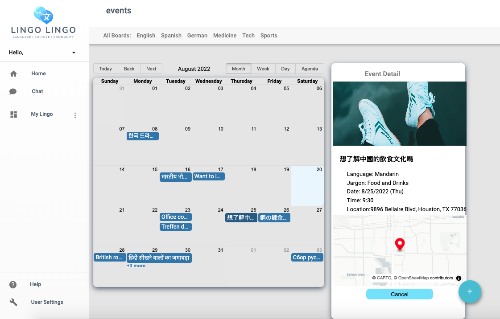
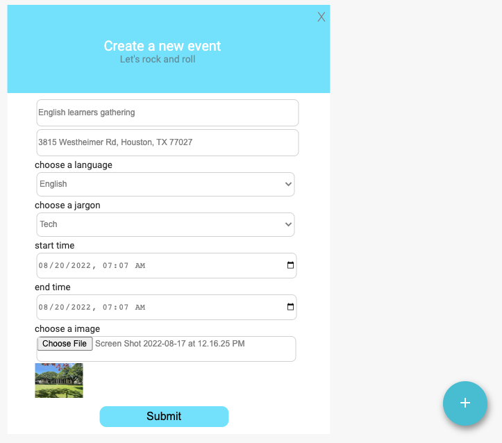

<!-- <div style="display: flex; flex-direction: column; justify-content: center;"> -->
<div style="position: relative;">

<div style="align-self: flex-start;>
<h1 style="color: white"> Lingo Lingo </h1>

<div align="left">


</div>
<br></br>
<div align="center">
  
</div>

 <h2 style="color:#73E0FE"> About: </h2>

Our team was tasked with the development and design of an online language exchange platform consisting of a forum, chat feature, and event scheduler. The forum will allow the user to ask and answer questions to gain a better understanding of a new language. The chat feature allows users to directly message other users and the event calendar will allow users to schedule events.

<hr style="background-color: #5c5c5c;height: 2.0px;"/>

<p align="center">
<a href="#overview" style="color: white">Overview</a> |
<a href="#questions--answers" style="color: white">Questions & Answers</a> |
<a href="#ratings--reviews" style="color: white">Ratings & Reviews</a> |
<a href="#-installation-" style="color: white">Installation</a> |
<a href="#-git-work-flow-" style="color: white">Git Work Flow</a> |
<a href="#-testing-" style="color: white">Testing</a>
</p>

<hr style="background-color: #5c5c5c;height: 2.0px;"/>

<h2 style="color:#73E0FE"> Components </h2>

This section provides a broad overview of just a few of the exciting functionalities our team implemented for the Lingo Lingo web platform.

- <b> User authentication: </b> New end-users are required to create a user account with log-in details. Upon opening the app, the user will be prompted to provide their log-in details if not already logged in, and/or create a new user account in order to access the app’s functionalities.
- <b> Forum Category Filtering: </b> The user will have the optserion to filter the topics they wish to view by category, or by clicking on any of the module tags on the module description.
- <b> Viewing a Forum Post:  </b>  When users click on a post it will bring up the details of the post and associated responses, allowing the users to interact.
- <b> Live Chat Feature: </b>  Will allow users to chat with individual users directly. Will have a log of all previous conversations and display a list of all connections.
- <b> Events: </b> Will allow users to schedule and announce an event. Events will be clickable to display the event detail and allow the user to save it to their calendar.
- <b> Profiles: </b> User profiles will consist of a brief bio, languages the user wants to learn, current languages the user speaks, the topics they are interested in, and the ability to start a chat with that user. The user will have the ability to add other users to their connections list. The user will be able to modify their own profile.


### User Authentication

<!-- info about user authentication here -->

#### subtitle here


<!-- some text about the above image -->

### Forum Posts
Users can ask questions and sort through them by language, topic, or both. Users can also navigate the site using their voice by speaking forum titles.

[forum titles](https://user-images.githubusercontent.com/41023883/186042128-c1742b20-f3e8-4d97-9f5f-c456b847e4cd.png).


### Forum Category Filtering
Users can click on a topic in the header or in an individual forum module's link in order to filter posts by that topic.


### Posting
Users can click the multifunction button in the bottom right to submit new questions to the forum.


### Event scheduler

The events component gives users an overview of the events they can attend. All the events are populated in the calendar. When a user clicks on an individual event, the event detail will be displayed on the side along with the map indicating the location if the address is provided in the description. A user can respond to join an event by clicking the “Add to your event” button and retract from the attendee list by clicking the “Cancel” button. Upon clicking on the empty spot on the calendar or the multi-function button, a user can create an event where the language and jargon selection are limited by the user’s preference.


#### screenshots

&nbsp;

<!-- some text about the above image -->

<hr style="background-color: #5c5c5c;height: 2.0px;"/>

<h2 style="color:#73E0FE"> Installation: </h2>

Getting your own copy of Project Atelier is easy!

- Fork and clone this repo to your local machine
- Run npm install to install dependencies
- Read about the following scripts to understand their functionality
- Enjoy!

### Scripts

The following scripts can be found in package.json

<hr style="background-color: #5c5c5c;height: 2.0px;"/>

`npm run server`

<i> Launches nodemon to watch the server path and serve static files </i>

`npm run dev`

<i> Launches webpack to bundle your webapp and watch for any changes </i>

`npm run start`

<i> Bundles your webpack in development mode </i>

`npm run build`

<i> Bundles your webpack in production mode </i>

`npm run test`

<i> Calls jest to run any user defined tests </i>

```
// in package.json

"scripts": {
    "server-dev": "npx nodemon --watch server server/server.js",
    "dev": "npx webpack --watch",
    "start": "Webpack --mode=development",
    "build": "webpack --mode=production",
    "test": "jest"
  },
```

<hr style="background-color: #5c5c5c;height: 2.0px;"/>

<h2 style="color:#73E0FE"> Git Work Flow </h2>

<h3> At the start of coding time </h3>
Switch to your local dev branch

```
git checkout dev
```

Pull the latest changes from the github's dev branch onto your local dev branch

```
git pull origin dev
```

<h3> Using feature branches </h3>
If you're continuing work on a feature branch, switch to your feature branch

```
git checkout feature-branch
```

THEN merge the changes you pulled from dev into your working feature branch

```
git merge dev
```

If you're starting work on a new feature branch, use -b to create a new branch

```
git checkout -b feature-branch
```

<h3> Please commit often </h3>

```
git add .

git commit
```

<h3> Rebase before pull request </h3>
To help ensure that you have the latest github version, this will pull the latest dev changes into YOUR feature branch.

```
git pull --rebase origin dev
```


<h3> Push your feature branch to your fork

```
git push origin feature-branch
```

<h3> Make a pull request on GitHub </h3>

<b>Make sure you are pulling from your feature branch to the base dev NOT main</b>
Change what you do next below depending if your pull is accepted or rejected after review

<hr style="background-color: #5c5c5c;height: 2.0px;"/>
<hr style="background-color: #5c5c5c;height: 2.0px;"/>

<h3> If pull request is rejected then fix bugs, commit </h3>

```
git add .
git commit
git pull --rebase origin dev
git push origin feature-branch
```

<h3>Make a pull request on GitHub </h3>
<b>Make sure to pull from your feature branch to the base dev NOT main</b>

<hr style="background-color: #5c5c5c;height: 2.0px;"/>
<hr style="background-color: #5c5c5c;height: 2.0px;"/>

<h3> if pull request is accepted </h3>

```
git checkout dev
```
This is to keep your dev branch up to date

```
git pull --rebase origin dev
```
It helps keeps things the repo cleaner to delete your feature branch once you are completely done with your feature. The -d is for delete.
```
git branch -d feature-branch
```


<hr style="background-color: #5c5c5c;height: 2.0px;"/>

<h2 style="color:#73E0FE"> Contributors </h2>

<table >
    <td align="center">
        <a href="https://github.com/tinyfishbigpond" style="color: white; text-decoration: none;">
            
            <br />
            <sub>
                <b><span style="color: white"> David F. </span> | <span style="color: #229AEF">tinyfishbigpond</span></b>
            </sub>
        </a>
        <br /><br>
        <a href="https://github.com/Team-Scar/Lingo-Lingo/issues?q=is%3Aclosed+author%3Atinyfishbigpond" title="Commits">💻</a> &nbsp;
        <a href="https://github.com/Team-Scar/Lingo-Lingo/tree/dev/client/src/components/livechat" title="Component">📖</a> &nbsp;
    </td>
    <td align="center">
        <a href="https://github.com/dkroll713" style="color: white; text-decoration: none;">
            
            <br />
            <sub>
                <b><span style="color: white"> David K. </span> | <span style="color: #229AEF">dkroll713</span></b>
            </sub>
        </a>
        <br /><br>
        <a href="https://github.com/Team-Scar/Lingo-Lingo/issues?q=is%3Aclosed+author%3Adkroll713" title="Commits">💻</a> &nbsp;
        <a href="https://github.com/Team-Scar/Lingo-Lingo/tree/dev/client/src/components/forum" title="Component">📖</a> &nbsp;
    </td>
    <td align="center">
        <a href="https://github.com/syed216" style="color: white; text-decoration: none;">
            
            <br />
            <sub>
                <b><span style="color: white"> Fahad S.</span> | <span style="color: #229AEF"> syed216</span></b>
            </sub>
        </a>
        <br /><br>
        <a href="https://github.com/Team-Scar/Lingo-Lingo/issues?q=is%3Aclosed+author%3Asyed216" title="Commits">💻</a> &nbsp;
        <a href="https://github.com/Team-Scar/Lingo-Lingo/tree/dev/client/src/components/userprofile" title="Component">📖</a> &nbsp;
    </td>
    <td align="center">
        <a href="https://github.com/mayliang021" style="color: white; text-decoration: none;">
            
            <br />
            <sub>
                <b><span style="color: white"> May L.</span> | <span style="color: #229AEF"> mayliang021</span></b>
            </sub>
        </a>
        <br /><br>
        <a href="https://github.com/Team-Scar/Lingo-Lingo/issues?q=is%3Aclosed+author%3Amayliang021" title="Commits">💻</a> &nbsp;
        <a href="https://github.com/Team-Scar/Lingo-Lingo/tree/dev/client/src/components/userauth" title="Component">📖</a> &nbsp;
    </td>
    <td align="center">
        <a href="https://github.com/sharonhw888" style="color: white; text-decoration: none;">
            
            <br />
            <sub>
                <b><span style="color: white"> Sharon W.</span> | <span style="color: #229AEF"> sharonhw888</span></b>
            </sub>
        </a>
        <br /><br>
        <a href="https://github.com/Team-Scar/Lingo-Lingo/issues?q=is%3Aclosed+author%3Asharonhw888" title="Commits">💻</a> &nbsp;
        <a href="https://github.com/Team-Scar/Lingo-Lingo/tree/dev/client/src/components/events" title="Component">📖</a> &nbsp;
    </td>
    <td align="center">
        <a href="https://github.com/Symphon-y" style="color: white; text-decoration: none;">
            
            <br />
            <sub>
                <b><span style="color: white"> Travis R. </span> | <span style="color: #229AEF"> Symphon-y </span></b>
            </sub>
        </a>
        <br /><br>
        <a href="https://github.com/Team-Scar/Lingo-Lingo/issues?q=is%3Aclosed+author%3ASymphon-y" title="Commits">💻</a> &nbsp;
        <a href="https://github.com/Team-Scar/Lingo-Lingo/tree/dev/client/src/components/sidebar" title="Component">📖</a> &nbsp;
    </td>
    <td align="center">
        <a href="https://github.com/Symphon-y" style="color: white; text-decoration: none;">
            
            <br />
            <sub>
                <b><span style="color: white"> Viren P. </span> | <span style="color: #229AEF"> vpatel89 </span></b>
            </sub>
        </a>
        <br /><br>
        <a href="https://github.com/Team-Scar/Lingo-Lingo/issues?q=is%3Aclosed+author%3Avpatel89" title="Commits">💻</a> &nbsp;
        <a href="https://github.com/Team-Scar/Lingo-Lingo/tree/dev/client/src/components/forum_details" title="Component">📖</a> &nbsp;
    </td>
<table>
</div>
    <div style="position: absolute; top: 150vw; left: -8vw; opacity: .04; background-image: url(Assets/leftFoot.svg); background-repeat: no-repeat; transform: scale(100);">
    &nbsp;
    </div>
        <div style="position: absolute; top: 400vw; margin-left: 90vw; opacity: .04; background-image: url(Assets/Favicon.svg); background-repeat: no-repeat; transform: scale(100);">
    &nbsp;
    </div>
        <div style="position: absolute; top: 850vw; left: -8vw; opacity: .04; background-image: url(Assets/leftFoot.svg); background-repeat: no-repeat; transform: scale(100);">
    &nbsp;
    </div>
</div>
